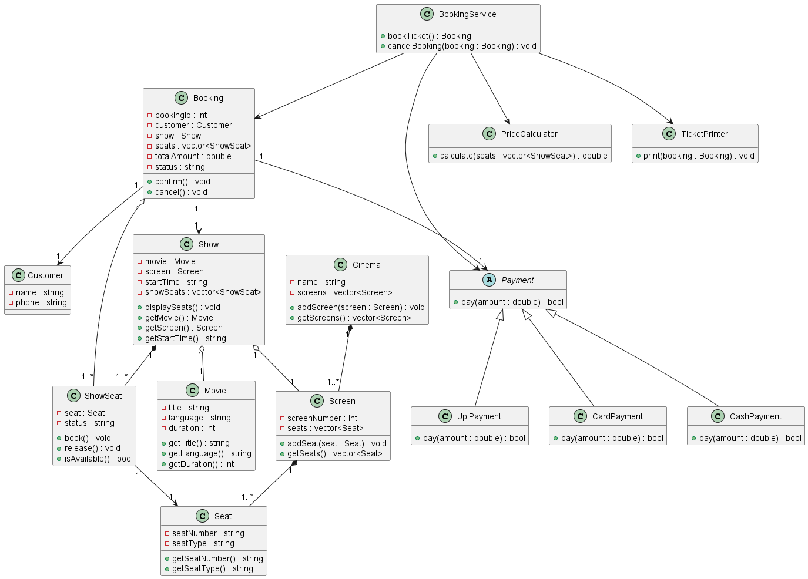
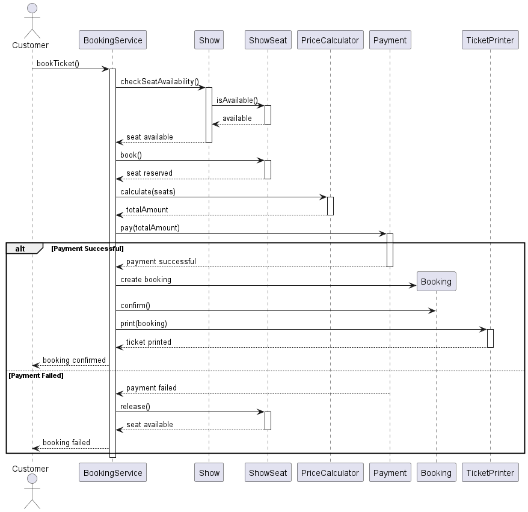

# 🎬 Movie Ticket Booking System

A simple **menu-driven Movie Ticket Booking System** developed in **C++** as a System Design assignment.

The project models a single cinema where users can view movies, select shows, check seats, book tickets, make payments, print tickets, and cancel bookings.

---

## 📌 Features

* 🎬 List currently playing movies
* 🕐 View available shows
* 💺 View seat availability
* 🎟️ Book one or multiple seats
* 💰 Silver, Gold, and Platinum pricing
* 💳 UPI, Card, and Cash payment
* ⚠️ Payment failure handling
* 🧾 Ticket printing
* ❌ Booking cancellation
* 🔄 Release seats after cancellation

---

## 💰 Seat Pricing

| Seat Type | Price |
| --------- | ----: |
| SILVER    |  ₹150 |
| GOLD      |  ₹250 |
| PLATINUM  |  ₹400 |

---

## 🏗️ System Design

The project uses object-oriented design with the following main classes:

```text
Cinema
  └── Screen
        └── Seat

Show
  ├── Movie
  └── ShowSeat

Booking
  ├── Customer
  └── ShowSeat

BookingService
  ├── PriceCalculator
  ├── Payment
  └── TicketPrinter
```

### Payment Design

```text
        Payment
        ▲   ▲   ▲
        │   │   │
       UPI Card Cash
```

`Payment` is an abstract class, allowing runtime polymorphism.

---

## 📐 UML Diagrams

### Class Diagram



### Sequence Diagram



---

## 🧠 OOP Concepts Used

* **Encapsulation** — private data with public methods
* **Abstraction** — abstract `Payment` class
* **Inheritance** — UPI, Card, and Cash inherit from `Payment`
* **Runtime Polymorphism** — `Payment*`
* **Static Member** — automatic Booking ID generation
* **Composition** — Cinema–Screen, Screen–Seat, Show–ShowSeat
* **Aggregation** — Show–Movie, Show–Screen
* **Association** — Customer–Booking and service relationships
* **`this` keyword** — used in constructors

---

## 🧩 SOLID Principles

| Principle | Example                                                             |
| --------- | ------------------------------------------------------------------- |
| SRP       | Separate classes for booking, pricing, payment, and ticket printing |
| OCP       | New payment methods can be added                                    |
| LSP       | Payment subclasses work through `Payment*`                          |
| ISP       | Payment exposes only `pay()`                                        |
| DIP       | BookingService uses the Payment abstraction                         |

**Deliberately omitted:** Refund processing, as it is outside the assignment scope.

---

## 📂 Project Structure

```text
movie-ticket-booking-system/
│
├── docs/
│   └── Assignment.md
│
├── src/
│   ├── Movie.cpp
│   ├── Seat.cpp
│   ├── ShowSeat.cpp
│   ├── Screen.cpp
│   ├── Cinema.cpp
│   ├── Show.cpp
│   ├── Customer.cpp
│   ├── Booking.cpp
│   ├── Payment.cpp
│   ├── UpiPayment.cpp
│   ├── CardPayment.cpp
│   ├── CashPayment.cpp
│   ├── PriceCalculator.cpp
│   ├── TicketPrinter.cpp
│   ├── BookingService.cpp
│   └── main.cpp
│
└── uml/
    ├── class-diagram.puml
    ├── class-diagram.png
    ├── sequence-diagram.puml
    └── sequence-diagram.png
```

---

## ▶️ Run the Project

### Compile

```bash
g++ src/main.cpp -o movie_booking
```

### Run

```bash
.\movie_booking
```

---

## 🎓 Academic Context

**Course:** System Design
**Semester:** 5th Semester
**Language:** C++
**Project Type:** Console-based application

---

### 👩‍💻 Author

**Dixa**
B.Tech CSE (AI & ML)
Section:ML2
